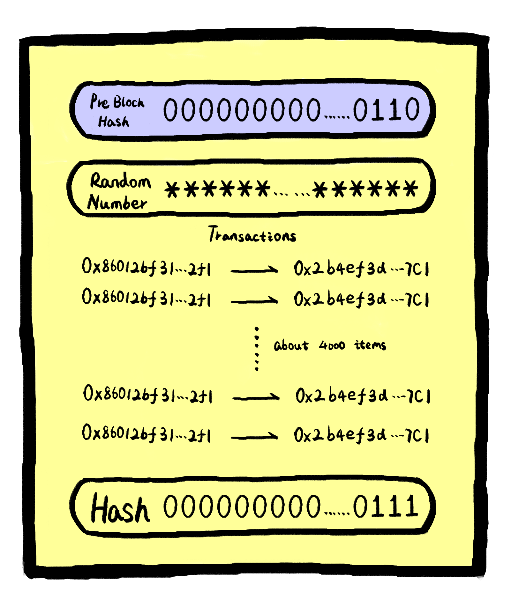
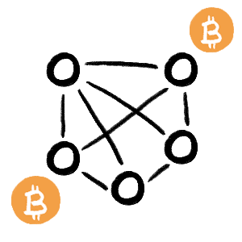
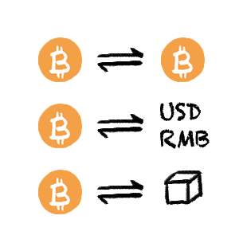
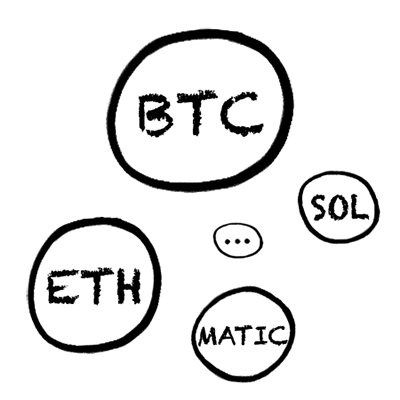
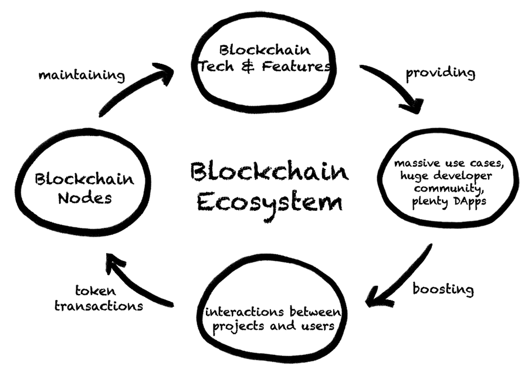

> 在本章，我们首先介绍区块链的基本概念，包括其定义、典型结构，接着阐述公链、私链与联盟链三种主要类型；然后解析一下 Web3 的内涵，并对比了 Web3、Web 3.0 与传统 Web2 的差异；最后探讨去中心化带来的主要优势与面临的挑战。

## 一、区块链是什么？

区块链是一种去中心化的分布式账本技术，用于在网络节点之间安全、透明且不可篡改地记录事务数据。每条链由一系列按照时间顺序相连的「区块」组成，每个区块内部包含了多笔交易数据及元数据，确保了数据记录的完整性与可追溯性。

这是 Wiki 上面非常严谨的定义，看不懂没关系，接下来我们会详细解释其中的每一个概念。
<br>

:::: card-grid
::: card
==**这是一个区块**=={.warning}

- 每一个区块包括两个部分：交易记录等一些信息, 和之前的区块摘要（哈希）。
- 每一个区块只有有限的存储容量。
- 每个区块会在一定时间内打包，例如大概 10 分钟打包生成一个。


:::
::: card
==**这是一条链**=={.warning}

- 一条链只可以链接两个区块。
- 只有一条链。
- 区块按照顺序依次串联。
  <br>
  <br>


:::
::::

::: card
==**合并在一起就是：区块链**=={.danger}
<br>


:::

<br>

### ==由此得出区块链特性=={.important}

<br>

::: danger 不可篡改
你无法改变历史信息，因为每个区块包含了上一个区块的摘要并串联起来，如果你修改了历史的区块，你将必须修改后面的全部区块。
:::

::: info 公开透明、匿名
在区块链上的信息全部公开透明。每个人都可以顺着区块和链找到历史上所有的记录来查看你的钱包余额。但是没人知道这是你的钱包。
:::

::: tip 快速交易
无论金额多少以及你在什么地方，只要你的交易记录被打包在区块链中，交易就自动完成。相比传统的跨国汇款非常快速便捷。
:::

<br>

### ==那么如何来确保历史交易记录真的没有被篡改而且可信呢？=={.important}

<br>


一个区块链网络中有非常多的节点（矿机）来记账，每个节点都会记录完整的、相同的区块链信息！

<br>

### ==有了分布式网络之后，区块链有了新特性=={.important}

<br>

::: important 去中心化
区块链网络通常分布在全球，每个节点都将会存储一份相同的区块链数据。没有人能够控制全部的节点，因此这份区块链数据将会一直存在。
:::

::: caution 真正的不可篡改
区块链网络通常分布在全球，一个人控制大部分节点几乎不可能，因此即便有人修改了部分节点的区块链数据，只要被修改记录的节点不超过 51%，这个改动将不会被认可。
:::

## 二、什么是比特币（BTC）？

> 去中心化和分布式网络很好，可是为什么会有人愿意提供这项服务呢？
> <br>
> 因为他们可以因此得到奖励：==比特币！==

<br>

:::: card-grid
::: card

==**节点可以得到奖励**=={.warning}

网络节点服务提供商（以下简称为网络服务提供商）可以得到奖励。不同的网络服务提供商可以得到不同的代币奖励，比如：比特币。


:::

::: card
==**比特币具备了货币属性**=={.warning}

根据比特币的设计，它仅有有限的供应量，而且可以自由转账。因此具备了货币的特性，成为了加密货币。


:::
::::

::: steps

### ==FAQ=={.important}

::: details 比特币有什么价值?
它具有货币的属性，按照白皮书的设计，不会通胀。同时根据区块链的特性它还具备以下特点：账户匿名、交易公开透明、不可篡改、完全在虚拟网络中，相比跨境转账结算等场景要方便许多。因此具备了一定的使用价值。
:::

::: details 为什么比特币会有如此高且不稳定的价格?
它的价格由供需决定，与大白菜、股票、货币没有区别。只不过没有监管和限制，容易受到热点新闻的影响出现大幅度波动。
:::

::: details 区块链如何实现交易公开透明同时保护隐私并且匿名呢?
在整个网络中，你的交易将通过一个随机生成的钱包地址完成，与这个钱包地址相关的交易等在网络上全部是公开透明的。匿名是因为别人不知道你跟这个钱包有关联。如果你在社交媒体发布过这个钱包地址，那么就可以将其跟你联系在一起。
:::

::: details 比特币有什么缺点?
匿名和自由有利也有弊。弊端在于难以追踪和限制，所以经常被黑产利用，进行洗钱等违法犯罪活动。由于每打包一个区块需要约 10 分钟，因此也会影响交易的实时性。每个区块的存储数据也是有限的。不过，越来越多的新区块链技术正在优化和解决这些问题。
:::

## 三、区块链的核心组成部分

由上面区块链和比特币内容我们可以得知区块链由两个核心组成

::: card
==**去中心化的网络和区块链**==

区块链将会有一条链来记录全部的信息，这条链将存在对应的去中心化网络中。
去中心化的网络，将由无数节点提供服务来维持网络运行。节点通过计算验证交易获得代币奖励。

{.full-width width="50%"}
:::
:::card
==**维持网络运行的代币激励**==

去中心化的网络由无数节点提供服务来维持网络运行，这些操作统称为挖矿。维持这些服务的人一般称之为矿工。矿工们维持网络运行需要奖励，就像你工作需要工资，在区块链中对矿工的奖励一般是代币，你经常听说的燃料费（Gas Fee）就是矿工们的「工资」。
你使用这个网络进行交易、转账、铸造 NFT 等等，均需要支付代币。如果你没有代币又想使用这个区块链网络服务，则需要进行代币之间交换或者法币交换。

{.full-width width="40%"}
:::

<br>

### ==一条区块链如何运行起来呢？=={.important}

区块链生态系统的运行包含以下几个关键步骤：

1. **用户发起交易**：用户通过钱包应用发起转账、智能合约调用等操作
2. **交易广播**：交易信息被广播到整个网络中的各个节点
3. **节点验证**：网络中的矿工节点验证交易的合法性（余额是否足够、签名是否正确等）
4. **打包成块**：通过共识机制（如工作量证明），矿工将验证过的交易打包成新的区块
5. **链接上链**：新区块被添加到区块链上，更新全网的账本状态
6. **奖励发放**：成功打包区块的矿工获得代币奖励和交易手续费

{.full-width width="80%"}

## 四、公链 vs 私链 vs 联盟链

区块链根据访问权限与治理模式，大致可分为三类。按照去中心化程度从高到低排列。


### 1. 公链（Public Blockchain） = 公共公园

::: card
想象一个**完全开放的公园**，任何人都可以自由进入、散步、拍照、甚至参与公园的维护（比如修剪草坪、清理垃圾）。公园里没有管理员，所有规则由大家共同制定。
:::

- **成为节点的方法**：
  - **无需申请**：任何人只要带着工具（比如手机、电脑）就能加入公园，成为维护者（节点）。
  - **自由进出**：你可以随时离开或回来，没人会拦你。
- **共同管理数据的模式**：
  - **所有人可见**：公园里的所有活动（比如谁修剪了草坪、谁清理了垃圾）都会被公开记录在公告栏上，所有人都能看到。
  - **去中心化决策**：如果公园需要修路，大家会投票决定（共识机制），不需要某个领导拍板。
  - **缺点**：因为人太多，决策效率低（交易确认慢），维护成本高（比如电费、人力）。

### 2. 联盟链（Consortium Blockchain） = 多公司联合的董事会

::: card
想象一个由**多家公司**（比如银行、物流公司）组成的**董事会**，他们共同管理一个共享数据库（比如客户信用信息）。只有这些公司才能参与决策，外人不能随便加入。
:::

- **成为节点的方法**：
  - **需要邀请或申请**：如果你想加入董事会，必须得到其中一家公司的认可（比如你是某家银行的合作伙伴）。
  - **权限分级**：董事会成员可能分为两类：
    - **决策者**（联盟核心成员）：比如银行 A、银行 B，可以修改数据库规则。
    - **观察者**（联盟普通成员）：比如物流公司，只能查看数据但不能修改。
- **共同管理数据的模式**：
  - **半公开数据**：数据库里的信息（比如客户信用评分）只有董事会成员能看到，外人无法访问。
  - **联合决策**：如果要修改数据库规则（比如增加新字段），需要董事会成员投票通过。
  - **优点**：效率比公链高（因为成员少），隐私比公链好（数据不对外公开），但不如私链灵活（需要多方协调）。

### 3. 私链（Private Blockchain） = 私人俱乐部

::: card
想象一个 **私人俱乐部**，只有会员才能进入。俱乐部的老板（比如 CEO）完全控制规则，比如谁可以加入、谁能查看账本（会员消费记录）。
:::

- **成为节点的方法**：
  - **严格审批**：想加入俱乐部？必须经过老板批准（比如交会员费、填写申请表）。
  - **固定成员**：一旦成为会员，你的权限由老板决定（比如能否查看账本、能否修改规则）。
- **共同管理数据的模式**：
  - **数据完全私有**：账本只对会员开放，外人无法查看（比如你的消费记录只有你和老板知道）。
  - **老板说了算**：如果俱乐部要改规则（比如涨价），老板可以直接决定，不需要投票。
  - **优点**：效率极高（因为只有少数人参与），隐私极强（数据不对外公开），但缺乏公链的透明性。

### 4. **总结对比**

| 区块链类型 | 节点加入方式        | 数据可见性     | 管理模式               | 适合场景           |
| ---------- | ------------------- | -------------- | ---------------------- | ------------------ |
| **公链**   | 任何人自由加入      | 所有人可见     | 去中心化（大家投票）   | 加密货币、公共存证 |
| **联盟链** | 需联盟成员邀请/审批 | 仅联盟成员可见 | 多中心化（董事会决策） | 供应链、金融协作   |
| **私链**   | 由老板严格审批      | 仅内部成员可见 | 中心化（老板说了算）   | 企业内部管理、审计 |

## 四、Web3 vs Web 3.0 vs Web2 的范式革命

### 1. Web2（当前互联网）

==**核心特征**：=={.important}

- **中心化控制**：数据存储在科技巨头的服务器（如 Google、Facebook）
- **用户角色**：内容生产者，但不拥有数据
- **商业模式**：广告驱动，平台抽取佣金
- **典型应用**：微信、抖音、亚马逊

**比喻**：
::: card
就像租房子，你可以装饰（发内容），但房东（平台）随时能收回钥匙（封号）。
:::

### 2. Web 3.0（语义网）

==**核心特征**：=={.important}

- **语义标记**：使用 RDF、OWL 等标准描述数据关系
- **结构化数据**：信息按照标准格式组织，便于机器理解
- **知识图谱**：构建实体间的语义关系网络
- **典型技术**：本体工程、语义查询语言（SPARQL）、链接数据

**关键区别**：

- ❌ **不是区块链技术**，而是传统互联网的数据组织升级
- ❌ **主要不依赖 AI**，而是通过标准化数据格式实现
- ✅ 与 Web3 可结合（语义标记 + 区块链存储）

**比喻**：
::: card
像把图书馆的每本书都贴上详细标签（作者、主题、关联书籍），让图书管理员能快速找到相关资料。
:::

### 3. Web3（去中心化互联网）

==**核心特征**：=={.important}

- **数据主权归用户**：用区块链存储身份和资产
- **无需信任中介**：智能合约自动执行规则
- **核心组件**：

  ```mermaid
  flowchart LR
      钱包 -->|签名| Dapp
      Dapp -->|调用| 智能合约
      智能合约 -->|读写| 区块链

  ```

- **典型应用**：MetaMask、Uniswap、ENS

**核心创新**：

- **真正拥有数字资产**：你的 NFT 头像、游戏道具真正属于你，平台无法删除或收回
- **金融服务无门槛**：无需银行卡，用手机钱包就能借贷、理财、交易
- **应用可自由组合**：一个 DeFi 协议的流动性可以被其他应用直接调用，就像搭积木
- **内容永不消失**：文章、图片存储在分布式网络，不会因为平台关闭而丢失

**比喻**：

::: card
像自己买地盖房（数据自托管），用智能合约管理水电费（自动结算）。
:::

### 4. **对比矩阵**

| 维度         | Web2            | Web 3.0       | Web3                |
| ------------ | --------------- | ------------- | ------------------- |
| **控制权**   | 平台垄断        | 部分开放      | 用户自治            |
| **数据存储** | 中心服务器      | 混合存储      | 区块链 / IPFS       |
| **支付系统** | 信用卡 / 支付宝 | 集成支付      | 加密货币            |
| **典型技术** | JavaScript      | RDF / OWL     | 智能合约            |
| **代表企业** | 腾讯 / 阿里     | W3C / DBpedia | Uniswap / ConsenSys |

### 5. **常见误解澄清**

1. **Web3 ≠ Web 3.0**
   - Web3 是**区块链驱动**的革命
   - Web 3.0 是**语义网技术驱动**的数据组织升级
2. **Web3 不是万能的**
   - 优势：金融、产权、隐私场景
   - 劣势：不适合高频社交（如微博）
3. **渐进式过渡**

   ```mermaid
   flowchart LR
       Web2 -->|+区块链登录| Web2.5 -->|完全去中心化| Web3

   ```

   - **Web2.5 案例**：Reddit 社区积分（链上积分+传统界面）

### 6. **技术栈对比**

**Web2 开发**：

```bash
React + Node.js + MySQL
```

**Web3 开发**：

```bash
React + Ethers.js + Solidity + IPFS
```

**Web 3.0 开发**：

```bash
Python + RDFLib + SPARQL
```

### 7. **该关注哪个？**

- 想参与去中心化金融？→ **学 Web3**（Solidity / Rust）
- 想构建知识图谱和语义搜索？→ **学 Web 3.0**（RDF / OWL）
- 想快速就业？→ **Web2 仍是主流市场**

## 五、去中心化的优势与挑战

### 1. 优势

::: steps

1.  **信任最小化**

    去中心化网络无需依赖中心化第三方，交易和数据由共识算法和加密证明保障，降低了 “信任成本”。

2.  **抗审查与高弹性**

    数据分布存储在多个节点，单点故障或审查攻击难以完全阻断网络，提升了系统的安全性和可用性。

3.  **用户自主管理**

    用户通过私钥掌控资产与数据，平台无法随意更改或冻结账户，赋予个人更高的隐私权和所有权。

4.  **开放创新生态**

        区块链与智能合约构建了去中心化应用（Dapps）平台，任何开发者都可在此基础上创新并获得代币激励，促进了技术和商业模式的多样化。

    :::

### 2. 挑战

::: steps

1.  **可扩展性瓶颈**

    公链在节点众多时共识效率低下，吞吐量和延迟问题突出，目前各大项目正通过分片、Layer 2 方案等技术进行优化。

2.  **安全与治理难题**

    区块链的不可篡改特性虽能保证数据安全，但代码漏洞或治理失衡（如 DAO 中投票权集中）也可能导致严重损失。

3.  **用户体验与成本**

    完全去中心化的系统往往对普通用户不够友好，如私钥管理复杂、交易手续费浮动大，需要在易用性与去中心化程度之间权衡。

4.  **法律与合规风险**

        去中心化和匿名特性与现行法规存在冲突，跨境监管和合规要求尚未完善，给项目方和用户带来不确定性。

    :::

## ::eos-icons:application-outlined /#32b2f0::扩展阅读

[1] 《我的第一个 NFT》：[https://nft.myfirst.io/](https://nft.myfirst.io/)

## ::ep:avatar /#32b2f0::文章贡献者

作者：[吃汤圆](https://x.com/web3_cty)  
排版：[Echo](https://x.com/Echo_liuchan)  
校对：[Bruce](https://x.com/brucexu_eth)
