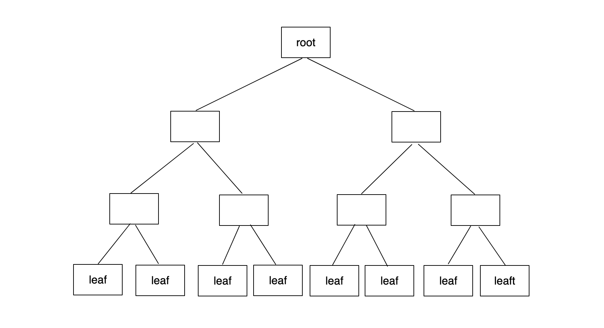
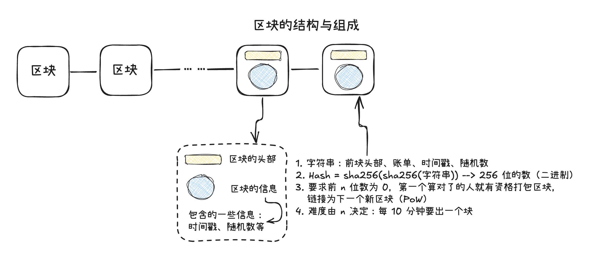

> 在本章，我们首先介绍区块链的基本概念，包括其定义、典型结构，接着阐述公链、私链与联盟链三种主要类型；然后解析一下 Web3 的内涵，并对比了 Web3、Web 3.0 与传统 Web2 的差异；最后探讨去中心化带来的主要优势与面临的挑战。

## 一、区块链是什么？

区块链是一种去中心化的分布式账本技术，用于在网络节点之间安全、透明且不可篡改地记录事务数据。每条链由一系列按照时间顺序相连的 “区块” 组成，每个区块内部包含了多笔交易数据及元数据，确保了数据记录的完整性与可追溯性。

这是 wiki 上面非常严谨的定义，看不懂没关系，接下来我们会详细解释其中的每一个概念。


## 二、为什么区块链上的数据不可篡改
::: steps
1. **数据从哪来？（交易生成）**

    ::: card 
    想象你在咖啡厅用区块链钱包给朋友转账 10 个以太币。这笔交易就像一张「电子收据」，包含你的签名、转账金额和接收方地址。
    :::

    **关键点：**

    - 交易由用户主动发起，是区块链的起点
    - 交易数据必须被验证（比如你账户余额是否充足）  


2. **数据怎么存？（打包成区块）**
    ::: card 
    矿工（或节点）会把一段时间内的交易打包成「区块」，就像快递员把多个包裹装进纸箱。
    ::: 
    **巧妙设计**：

    - **Merkle树**：所有交易先两两哈希计算，形成树结构，最终生成一个根哈希（Merkle Root），只要任意一笔交易（叶节点）被篡改，根哈希就会变！

    

    - **链式结构**：新区块会记录前一个区块的哈希值（类似「上一箱快递的编号」），这样所有区块首尾相连，形成「区块链」。
    
    
    
 3. **数据怎么传？（P2P网络传播）**
    ::: card 
    打包好的区块不会通过中心服务器发送，而是像「病毒式传播」扩散到全网：
    ::: 
    **工作方式**：

    - 每个节点收到新区块后，会同步给它的邻居节点
    - 最终所有节点都保存完整的账本副本（就像每个快递网点都有所有包裹的记录）


4. **数据怎么验？（共识机制确认）**
    ::: card 
    为了防止有人伪造交易，区块链用「民主投票」的方式确认数据有效性：
    ::: 
    **两种常见规则**：

    - **工作量证明（PoW）**：矿工比拼算力，谁先解出数学题，谁就获得记账权（比特币用的就是这个）
    - **权益证明（PoS）**：持币多、时间长的节点更容易被选中记账（以太坊2.0采用）

    **验证核心**：全网节点会检查新区块的合法性（比如交易是否真实、哈希是否正确），达成共识后才加入链上


5. **不可篡改的链**

    - **篡改代价极高**：要修改历史交易，必须同时修改该区块之后的所有区块，并控制超过51%的节点——这在现实中几乎不可能
    - **透明可追溯**：任何交易都能沿着Merkle树回溯到原始数据，全网共同监督
:::


通过「用户发起交易 → 打包成区块 → 全网传播 → 共识验证」这四个步骤，区块链用数学算法和网络协作替代了传统中心化机构，实现了无需信任的信任体系。这就是区块链「去中心化 + 不可篡改」的核心奥秘！


## 三、公链 vs 私链 vs 联盟链

区块链根据访问权限与治理模式，大致可分为三类。按照去中心化程度从高到低排列。


### 1. 公链（Public Blockchain） = 公共公园
::: card 
想象一个**完全开放的公园**，任何人都可以自由进入、散步、拍照、甚至参与公园的维护（比如修剪草坪、清理垃圾）。公园里没有管理员，所有规则由大家共同制定。
::: 

- **成为节点的方法**：
    - **无需申请**：任何人只要带着工具（比如手机、电脑）就能加入公园，成为维护者（节点）。
    - **自由进出**：你可以随时离开或回来，没人会拦你。
- **共同管理数据的模式**：
    - **所有人可见**：公园里的所有活动（比如谁修剪了草坪、谁清理了垃圾）都会被公开记录在公告栏上，所有人都能看到。
    - **去中心化决策**：如果公园需要修路，大家会投票决定（共识机制），不需要某个领导拍板。
    - **缺点**：因为人太多，决策效率低（交易确认慢），维护成本高（比如电费、人力）。


### 2. 联盟链（Consortium Blockchain） = 多公司联合的董事会
::: card 
想象一个由**多家公司**（比如银行、物流公司）组成的**董事会**，他们共同管理一个共享数据库（比如客户信用信息）。只有这些公司才能参与决策，外人不能随便加入。
::: 
- **成为节点的方法**：
    - **需要邀请或申请**：如果你想加入董事会，必须得到其中一家公司的认可（比如你是某家银行的合作伙伴）。
    - **权限分级**：董事会成员可能分为两类：
        - **决策者**（联盟核心成员）：比如银行A、银行B，可以修改数据库规则。
        - **观察者**（联盟普通成员）：比如物流公司，只能查看数据但不能修改。
- **共同管理数据的模式**：
    - **半公开数据**：数据库里的信息（比如客户信用评分）只有董事会成员能看到，外人无法访问。
    - **联合决策**：如果要修改数据库规则（比如增加新字段），需要董事会成员投票通过。
    - **优点**：效率比公链高（因为成员少），隐私比公链好（数据不对外公开），但不如私链灵活（需要多方协调）。


### 3. 私链（Private Blockchain） = 私人俱乐部
::: card 
想象一个**私人俱乐部**，只有会员才能进入。俱乐部的老板（比如CEO）完全控制规则，比如谁可以加入、谁能查看账本（会员消费记录）。
:::
- **成为节点的方法**：
    - **严格审批**：想加入俱乐部？必须经过老板批准（比如交会员费、填写申请表）。
    - **固定成员**：一旦成为会员，你的权限由老板决定（比如能否查看账本、能否修改规则）。
- **共同管理数据的模式**：
    - **数据完全私有**：账本只对会员开放，外人无法查看（比如你的消费记录只有你和老板知道）。
    - **老板说了算**：如果俱乐部要改规则（比如涨价），老板可以直接决定，不需要投票。
    - **优点**：效率极高（因为只有少数人参与），隐私极强（数据不对外公开），但缺乏公链的透明性。


### 4. **总结对比**

| 区块链类型 | 节点加入方式 | 数据可见性 | 管理模式 | 适合场景 |
| --- | --- | --- | --- | --- |
| **公链** | 任何人自由加入 | 所有人可见 | 去中心化（大家投票） | 加密货币、公共存证 |
| **联盟链** | 需联盟成员邀请/审批 | 仅联盟成员可见 | 多中心化（董事会决策） | 供应链、金融协作 |
| **私链** | 由老板严格审批 | 仅内部成员可见 | 中心化（老板说了算） | 企业内部管理、审计 |


## 四、Web3 vs Web 3.0 vs Web2 的范式革命

### 1. Web2（当前互联网）

**核心特征**：

- **中心化控制**：数据存储在科技巨头的服务器（如 Google、Facebook）
- **用户角色**：内容生产者，但不拥有数据
- **商业模式**：广告驱动，平台抽取佣金
- **典型应用**：微信、抖音、亚马逊

**比喻**：
::: card 
就像租房子，你可以装饰（发内容），但房东（平台）随时能收回钥匙（封号）。
::: 

### 2. Web 3.0（语义网）

**核心特征**：

- **机器可读数据**：AI 自动理解内容（如谷歌知识图谱）
- **技术基础**：RDF、OWL、自然语言处理
- **目标**：让互联网"更智能"
- **典型应用**：Siri 语音搜索、智能推荐系统

**关键区别**：

- ❌ **不是区块链**，而是传统互联网的升级
- ✅ 与 Web3 可结合（ **Web 3.0** + 区块链）

**比喻**：
::: card 
像有个私人图书管理员（AI），能立刻找到你要的书（信息）。
::: 

### 3. Web3（去中心化互联网）

**核心特征**：

- **数据主权归用户**：用区块链存储身份和资产
- **无需信任中介**：智能合约自动执行规则
- **核心组件**：
    
    ```mermaid
    flowchart LR
        钱包 -->|签名| DApp
        DApp -->|调用| 智能合约
        智能合约 -->|读写| 区块链
    
    ```
    
- **典型应用**：MetaMask、Uniswap、StepN

**核心创新**：

- **数字产权**：NFT 代表独一无二的所有权
- **可组合性**：DeFi 协议像乐高自由拼接
- **抗审查**：内容存储在 IPFS/Arweave

**比喻**：

::: card 
像自己买地盖房（数据自托管），用智能合约管理水电费（自动结算）。
::: 

### 4. **对比矩阵**

| 维度 | Web2 | Web 3.0 | Web3 |
| --- | --- | --- | --- |
| **控制权** | 平台垄断 | 部分开放 | 用户自治 |
| **数据存储** | 中心服务器 | 混合存储 | 区块链 / IPFS |
| **支付系统** | 信用卡 / 支付宝 | 集成支付 | 加密货币 |
| **典型技术** | JavaScript | AI / 语义网 | 智能合约 |
| **代表企业** | 腾讯 / 阿里 | Google / OpenAI | Uniswap / Coinbase |


### 5. **常见误解澄清**

1. **Web3 ≠ Web 3.0**
    - Web3 是**区块链驱动**的革命
    - Web 3.0 是 **AI 驱动**的演进
2. **Web3不是万能的**
    - 优势：金融、产权、隐私场景
    - 劣势：不适合高频社交（如微博）
3. **渐进式过渡**
    
    ```mermaid
    flowchart LR
        Web2 -->|+区块链登录| Web2.5 -->|完全去中心化| Web3
    
    ```
    
    - **Web2.5 案例**：Reddit 社区积分（链上积分+传统界面）


### 6. **技术栈对比**

**Web2 开发**：

```bash
React + Node.js + MySQL
```

**Web3 开发**：

```bash
React + Ethers.js + Solidity + IPFS
```

**Web 3.0 开发**：

```bash
Python + RDFLib + TensorFlow
```


### 7. **该关注哪个？**

- 想颠覆现有平台？→ **学 Web3**（Solidity / Rust）
- 想优化信息检索？→ **学 Web 3.0**（语义网技术）
- 想快速变现？→ **Web2 仍主导市场**


## 五、去中心化的优势与挑战

### 1. 优势

1. **信任最小化**
    
    去中心化网络无需依赖中心化第三方，交易和数据由共识算法和加密证明保障，降低了 “信任成本”。
    
2. **抗审查与高弹性**
    
    数据分布存储在多个节点，单点故障或审查攻击难以完全阻断网络，提升了系统的安全性和可用性。
    
3. **用户自主管理**
    
    用户通过私钥掌控资产与数据，平台无法随意更改或冻结账户，赋予个人更高的隐私权和所有权。
    
4. **开放创新生态**
    
    区块链与智能合约构建了去中心化应用（dApps）平台，任何开发者都可在此基础上创新并获得代币激励，促进了技术和商业模式的多样化。
    

### 2. 挑战

1. **可扩展性瓶颈**
    
    公链在节点众多时共识效率低下，吞吐量和延迟问题突出，目前各大项目正通过分片、Layer2 方案等技术进行优化。
    
2. **安全与治理难题**
    
    区块链的不可篡改特性虽能保证数据安全，但代码漏洞或治理失衡（如 DAO 中投票权集中）也可能导致严重损失。
    
3. **用户体验与成本**
    
    完全去中心化的系统往往对普通用户不够友好，如私钥管理复杂、交易手续费浮动大，需要在易用性与去中心化程度之间权衡。
    
4. **法律与合规风险**
    
    去中心化和匿名特性与现行法规存在冲突，跨境监管和合规要求尚未完善，给项目方和用户带来不确定性。