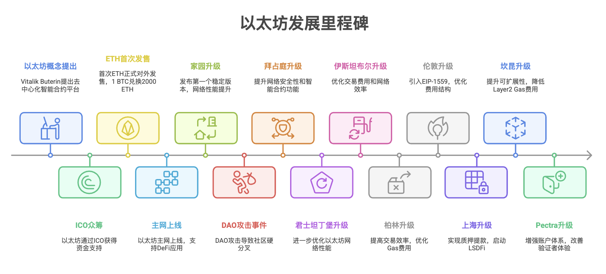
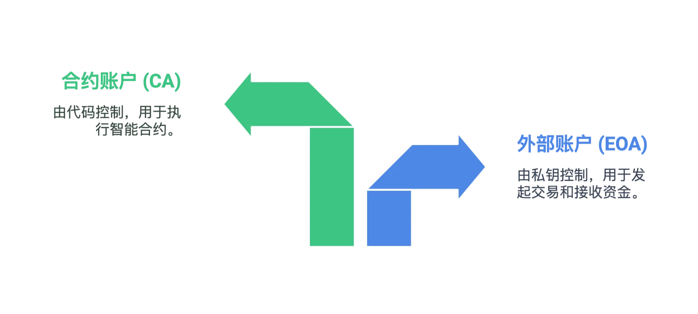

> 以太坊（Ethereum）被称为「区块链 2.0」，它不仅是一种加密货币（以太币 ETH），更是一台支持 **智能合约** 的「全球共享计算机」。通过代码自动执行规则，开发者可以在区块链上构建去中心化金融（DeFi）、数字艺术品（NFT）和社区自治组织（DAO）等创新应用，无需依赖银行或中心化平台。2022 年完成从「挖矿」（PoW）到更环保的「权益证明」（PoS）的升级（The Merge），并借助分片和 Layer 2 技术提升效率与扩展性。以太坊不仅是技术协议，更承载着去中心化的文化理念——用代码和社区协作重塑信任与价值分配，成为 Web3 时代的数字基础设施[^1]。

## 一. 以太坊的介绍

以太坊（Ethereum）是一个开源的去中心化区块链平台，通过其原生加密货币以太币（Ether，简称 ETH）提供去中心化的以太虚拟机（EVM）来处理点对点合约。它由程序员 ==维塔利克·布特林（Vitalik Buterin）== 于 2013-2014 年间提出，目标是构建「下一代加密货币与去中心化应用平台」。2014 年，以太坊正式启动，成为继比特币之后最重要的区块链项目之一。

以太坊的核心创新在于 ==智能合约（Smart Contracts）== 。智能合约是存储在区块链上的可执行代码，能够在满足预设条件时自动执行操作，无需人工干预。这一特性使得以太坊不仅是数字货币的载体，更是构建去中心化应用（Dapps）、去中心化金融（DeFi）、非同质化代币（NFT）等生态系统的基础设施。截至 2025 年，以太币（ETH）仍是全球市值排名第二的加密货币，仅次于比特币。

以太坊的定位是「区块链 2.0」的代表。如果说比特币是区块链 1.0 的象征（专注于货币属性），那么以太坊则通过智能合约和可编程性，推动区块链技术向更广泛的应用场景拓展。==其目标是成为全球范围内的「世界计算机」== ，为开发者提供构建复杂应用的工具和环境。

<!-- ::: card -->

以太币（ETH）是其代币
在以太坊上进行的任何操作或者交易，需要使用以太币（ETH）来支付相关费用。

由于区块链是去中心化的，因此在区块链上的操作都需要支付手续费给网络服务提供商。
这个手续费通常称为 Gas Fee（正如你开车到达目的地时，需要燃烧汽油一样）。

<!-- ::: -->

## 二、Ethereum 与 Bitcoin 的差异

尽管以太坊和比特币均基于区块链技术，但两者的设计目标、功能和技术路线存在显著差异：

|    **维度**    | **比特币（Bitcoin）**                                          | **以太坊（Ethereum）**                                        |
| :------------: | -------------------------------------------------------------- | ------------------------------------------------------------- |
| **目标与定位** | 去中心化的数字货币，强调安全、稳定和稀缺性（总量 2100 万枚）。 | 去中心化平台，支持智能合约和 Dapps，定位为「区块链 2.0」。    |
|  **编程能力**  | 脚本语言有限，仅支持简单的交易验证逻辑。                       | 图灵完备的编程语言（如 Solidity），可开发复杂智能合约。       |
|  **共识机制**  | 工作量证明（PoW），矿工通过算力竞争记账权。                    | 从 PoW 转向权益证明（PoS），通过 The Merge 实现能源效率优化。 |
|  **交易速度**  | 每 10 分钟生成一个区块，交易确认较慢。                         | 区块时间约 13-15 秒，交易确认更快，适合高频应用。             |
|  **经济模型**  | 总量固定，强调抗通胀属性。                                     | 供应灵活，通过 EIP-1559 等机制可能呈现通缩趋势。              |

以太坊的灵活性使其能够支持更多应用场景，例如 DeFi（借贷、交易）、NFT（数字艺术品）、DAO（去中心化自治组织）等，而比特币则更专注于作为「数字黄金」存储价值。

<!-- .png) -->
<!--  -->

## 三. 以太坊的定位与演进（从 PoW 到 PoS，合并事件 The Merge）

以太坊是一个基于区块链的 ==去中心化计算平台== ，它的目标是成为「全球计算机」，让任何人无需依赖第三方即可进行交易、管理数据或运行应用。为了实现这一目标，以太坊经历了多次重大升级，其中最关键的是从 ==工作量证明（PoW）转向权益证明（PoS）== ，以及被称为 ==The Merge（合并）== 的里程碑事件。

### 1. 以太坊 1.0（PoW 阶段）

以太坊最初像比特币一样，使用 **PoW（工作量证明）** 机制来维护网络安全。简单来说：

- 矿工通过计算机算力「挖矿」，争夺打包交易的权利。
- 矿工需要消耗大量电力资源，竞争激烈。
- 成功打包区块的矿工会获得新生成的 ETH 奖励。

**问题**：

- **能耗高**：全球以太坊矿工的电力消耗相当于一个小国家的用电量。
- **扩展性差**：每秒只能处理约 30 笔交易（TPS），速度慢、费用高。

为了解决这些问题，以太坊启动了多次升级（如 Homestead、Metropolis），逐步优化网络性能和安全性，但核心的 PoW 机制仍未改变。

### 2. 以太坊 2.0 与 The Merge

2022 年 9 月，以太坊完成了 **The Merge**（合并），这是其历史上最重要的升级之一。它的核心目标是：

- **从 PoW 切换到 PoS**（权益证明）
- **降低能耗**
- **提升效率与安全性**
  
:::: card-grid
::: card

#### ==（1）什么是 PoS？==

**在 PoS 机制中：**

- **验证者**（代替矿工）通过质押 32 ETH 参与网络维护。
- 验证者被随机选择来打包交易，不再需要消耗算力。
- 如果验证者作恶，质押的 ETH 会被「罚没」（Slashing）。

**优点**：

- **能耗降低 99.95%**：PoS 几乎不消耗电力，更加环保。
- **安全性更高**：攻击网络的成本极高（需控制超过 50% 的质押 ETH）。
- **扩展性基础**：为后续升级（如分片）铺平道路。
:::

::: card

#### ==（2）The Merge 的意义==

- **合并了两条链**：
  - 以太坊主网（负责交易和智能合约）
  - 信标链（Beacon Chain，专门管理 PoS 共识）

合并后，主网正式切换为 PoS 机制。

- **对用户的影响**： - ETH 挖矿停止，矿工转为验证者。 - Gas 费用可能降低（但受市场供需影响）。 - ETH 总供应量减少（每年销毁约 0.5% 的 ETH）。
  :::
  ::::

### 3. 未来升级路线图

The Merge 只是起点，以太坊的「进化」还在继续！接下来的升级目标是：**让更多人用得起、用得快、用得安全**。以下是重点方向：
::: steps

1.  ==**分片（Sharding）——「分组提速」**=={.important}

    - **问题**：现在的以太坊就像一条车道的高速公路，堵车严重，交易慢、费用高。
    - **解决方案**：
      把网络分成多个「小分组」（分片链），就像 **建多条车道**，每条车道独立处理交易。
    - **效果**：

      - 理论上可支持 **10 万笔/秒** 的交易（TPS），比现在快 **3000 倍**！
      - Gas 费可能从几美元降到几美分。

    - **时间表**：预计 **2025-2026 年** 逐步上线（分阶段实施）。  
         

2.  ==**EIP-4844（Cancun 升级）——「省钱神器」**=={.important}

    - **问题**：Layer 2（L2）虽然便宜，但上传数据到以太坊主网的成本仍然太高。
    - **解决方案**：
      EIP-4844 引入了「Blob 交易」，让 L2 能更高效地向主网提交数据，优化扩容路径[^3]。
    - **效果**： - L2 交易费用再降 **70%~90%**，普通人转账、玩游戏、买 NFT 都更便宜。 - 更多应用能用得起以太坊。
    - **时间表**：**2023 年 12 月** 已在测试网运行，已于 **2024 年** 上线主网。  
       

3.  ==**ZK-Rollup 与 Validium——「隐私+效率双保险」**=={.important}

    - **问题**：区块链公开透明是优点，但有时我们希望交易更私密，同时更快。
    - **解决方案**：
      - **ZK-Rollup**：在链下批量处理交易，只向主网提交一个「数学证明」（类似成绩单），证明交易合法。
      - **优点**：速度快、费用低、隐私好。
      - **缺点**：需要依赖复杂的技术（零知识证明）。
      - **Validium**：和 ZK-Rollup 类似，但数据存在「第三方服务器」（如云存储），速度更快但稍微牺牲一点安全性。
    - **意义**： - 想保护隐私（如匿名捐款）？用 ZK-Rollup。 - 想极致速度（如高频交易）？用 Validium。 - 以太坊通过它们实现「鱼与熊掌兼得」。  
       

4.  ==**其他升级：小步快跑，持续优化**=={.important}

    - **EIP-1559 改革**：让 Gas 费更稳定（类似「动态定价」）。
    - **Verkle 树**：减少区块大小，让节点运行更轻松。
    - **eWASM 引擎**：让智能合约运行更快、更兼容新编程语言。

:::

::: note **以太坊的「三步走」计划**

1. **The Merge（完成）**：从高能耗 PoW → 低能耗 PoS。
2. **EIP-4844（进行中）**：让 L2 更便宜，普通人用得起。
3. **分片+ZK（未来）**：实现超高速、超低成本、超强隐私。

:::

## **四、以太坊生态概览：L1、L2、Sidechains 等**

以太坊的生态系统由多层架构组成，包括 L1（主网）、L2（二层扩展解决方案）、**侧链（Sidechains）** 等，共同支持高吞吐量和低费用的交易处理。
::: steps

1. **Layer 1（L1）**
   - **以太坊主网**：核心区块链，负责最终安全性与共识。
   - **EVM**：以太坊虚拟机，执行智能合约代码。
   - **账户系统**：外部账户（EOA）与合约账户（CA）共同构成网络基础。
2. **Layer 2（L2）**
   - **Rollup**：通过将交易批量处理后提交至 L1，降低 Gas 费。
     - **Optimistic Rollup**：假设交易合法，仅在争议时验证。
     - **ZK Rollup**：通过零知识证明验证交易，无需链上争议。
3. **侧链（Sidechains）**：独立运行的链，通过桥接与主网交互。
4. **以太坊协议分层结构及代表性生态项目**
   :::

这张图是对**以太坊（Ethereum）技术栈分层架构**的可视化总结，每一层代表以太坊生态系统中的不同组成部分及其作用。它按从上到下的技术栈顺序进行组织，越往下越接近底层区块链协议，越往上越贴近终端用户的实际应用。

---

### 各层含义解释：

#### 1. **Application Layer（应用层）**

这是用户直接交互的界面。

- **MetaMask**：浏览器钱包插件，用于管理账户和签名交易。
- **Farcaster**：去中心化社交协议。

#### 2. **Middleware / Abstraction Layer（中间件 / 抽象层）**

简化开发或用户体验，屏蔽底层复杂逻辑。

- **ERC-4337**：账号抽象标准，实现“智能钱包”。
- **Gelato Network**：自动化任务服务，比如自动执行交易、清算等。

#### 3. **Protocol Layer（协议层）**

构建在以太坊之上的功能性协议或 DeFi 产品。

- **Aave**：去中心化借贷协议。
- **Uniswap**：去中心化交易所（AMM 机制）。

#### 4. **Scalability Layer（扩展性层）**

解决以太坊本体扩展性差的问题，主要是 Layer 2。

- **Optimism**：乐观 Rollup 解决方案。
- **zkSync Era**：基于零知识证明的 Rollup 解决方案。

#### 5. **Data Availability Layer（数据可用性层）**

确保 Rollup 等 L2 方案发布的数据在主链上是可用且可验证的。

- **Proto-Danksharding**：即将上线的以太坊提案，优化数据发布效率。
- **EigenDA**：EigenLayer 提出的模块化数据可用性解决方案。

#### 6. **Execution Layer（执行层）**

执行交易逻辑、处理状态变化的客户端软件。

- **Geth**：Go 语言版本的以太坊客户端。
- **Nethermind**：C#实现的以太坊客户端。

#### 7. **Consensus Layer（共识层）**

确保网络各节点对区块达成一致，是 PoS 机制的核心。

- **Prysm** 和 **Lighthouse**：用于以太坊信标链（共识层）的验证客户端。

## **五、以太坊文化（核心价值观、密码朋克）**

以太坊的文化深受 **密码朋克运动（Cypherpunk）** 影响，强调 ==**去中心化、自由、开放和协作**== [^2]。其核心价值观包括：

1. **无权限与无审查**

   任何人都可以参与以太坊网络，无需获得许可。智能合约代码公开透明，不可篡改，杜绝了中心化机构的审查风险。

2. **全球协作与开源精神**

   以太坊由全球开发者社区共同维护，其代码库完全开源。这种协作模式推动了技术创新和生态繁荣。

3. **抗审查与抗通胀**

   以太坊支持去中心化金融（DeFi），为用户提供了不受传统银行体系限制的金融服务。此外，通过通缩机制（如 EIP-1559），以太坊试图对抗通胀。

4. **密码朋克理念**

   密码朋克主张通过加密技术和分布式网络实现个人隐私和自由。以太坊的智能合约和去中心化特性完美契合这一理念，成为密码朋克思想的实践载体。

## 六、以太坊核心机制：从账户到执行的完整链路

在上面我们就了解到，以太坊不仅仅是一条区块链，更是一个全球共享的「分布式计算机」。它的核心价值在于通过代码实现无需信任的自动化规则（如智能合约），而这一切的背后依赖于三个关键机制：==**账户系统**、**Gas 模型** 和 **以太坊虚拟机（EVM）**=={.important}。

我们平时使用 **账户系统** 里面的 **外部账户（EOA）** 与区块链中的其他用户的 **外部账户（EOA）** 或者与智能合约所在的 **合约账户（CA）** 进行交互，而其中的 **Gas 模型** 是支撑整个网络的经济基础， **Gas 模型** 和其他经济来源支撑着全球的 **以太坊虚拟机（EVM）** 来实现以太坊网络。

### 1. 账户系统：你的数字身份

**账户系统** 包含一般给人类用户直接使用 ==**外部账户（EOA）**== 和给运行在以太坊上面的代码使用的 ==**合约账户（CA）**== 。

想象你第一次接触以太坊——你需要一个「数字钱包」来参与网络。这个钱包的核心是 ==**外部账户（EOA）**== ，它由一对密钥（私钥和公钥）生成，就像银行账户的密码和账号。私钥[+助记词]是你控制账户的「钥匙」，必须严格保密；公钥通过加密算法生成一个唯一的地址（如 `0xAbc...123`），你可以把它分享给朋友接收转账。

[+助记词]: 私钥的人类可读备份形式：**助记词（Mnemonic Phrase）**，由 12/24 个英文单词（如 `apple boat cat...`），组成，按 BIP-39 标准生成。

除了用户控制的 EOA，还有 ==**合约账户（CA）**== 。它们不像 EOA 那样受私钥控制，而是由代码驱动。比如，你部署一个智能合约（如一个 NFT 市场），区块链会自动生成一个 CA 地址（如 `0xDef...456`）。这个账户不能主动发起交易，只能通过 EOA 触发——比如你点击「购买 NFT」按钮时，EOA 向 CA 发送交易，CA 的代码自动执行出货逻辑。

每个账户都包含四个关键字段：

- **Nonce**：防止重复交易的计数器（EOA 记录发送次数，CA 记录创建合约次数）。
- **余额**：账户持有的 ETH 或代币数量（单位为 Wei）。
- **CodeHash**：EOA 为空，CA 存储代码哈希。
- **StorageRoot**：记录账户数据的 Merkle 树根哈希（如 NFT 归属）。

### 2. Gas 模型：交易的燃料费

<!-- TODO: 技术深度优化 - 考虑简化 Gas 计算公式，为实习生提供更易懂的解释 -->

当你用钱包使用自己的 EOA 发起一笔交易（比如转账或操作合约），这件事当然 **不会是免费的**，==你需要支付「燃料费」——也就是 **Gas**。==

Gas 是怎么计算的？

Gas 费用 = **用多少 × 每单位多少钱**，就像你打车一样：

- **Gas Limit（限额）**：你最多愿意“烧”多少燃料。
  比如你觉得最多可能需要 15 万单位，就设置 150,000。
- **Gas Price（单价）**：每单位燃料多少钱，用 Gwei 表示（1 Gwei = 0.000000001 ETH）。
  网络越拥堵，价格越贵，就像打车高峰期加价。

所以，**总费用 = Gas Limit × Gas Price**。

::: card
假设你设置 Gas Limit 为 150 000，Gas Price 为 100 Gwei，总费用就是 0.015 ETH。如果实际消耗 120 000 Gas，剩余 30 000 Gas × 100 Gwei = 0.003 ETH 会退还给你。
:::

Gas 的存在有两个目的：

- **激励矿工/验证者**：你给得越多（Gas Price 越高），他们越愿意优先处理你的交易。
- **防止资源滥用**：如果有人想让合约死循环，Gas 会用光，交易失败，系统不会被拖垮。

==在 EIP-1559 升级后，Gas Price 被拆分了：==

以前，Gas Price 全部给矿工。
现在，分成两部分：

- **基础费用（Base Fee）**：每个区块都会有，自动计算，直接销毁（直接消失）来帮助 ETH 通缩，毕竟物以稀为贵。
- **小费（Tip）**：你额外加的钱，用来鼓励矿工优先处理你。

---

### 3. 以太坊虚拟机（EVM）：代码的执行引擎

<!-- TODO: 技术深度优化 - EVM 概念对实习生可能过于复杂，考虑添加更多类比说明 -->

EVM（Ethereum Virtual Machine）是 **以太坊的“大脑”**，是专门用来**运行智能合约的虚拟计算机**。它运行在每个节点上，确保整个网络在处理代码时，**结果都一致、可信任**。

==EVM 的核心特点：=={.important}

- **图灵完备**：就像真正的电脑一样，EVM 可以执行各种逻辑，比如 if 判断、循环等。
- **全球同步**：每个矿工/节点都会自己执行一遍合约代码，保证结果一样。
- **隔离安全**：EVM 把合约“关”在一个小房间里运行，不允许它乱访问用户的数据和网络，保护隐私和安全。

## 七、一般流程与类比

### 1. 一般流程

::: steps

1. **用户通过 EOA 发起交易**（如调用合约与 **CA** 交互，或者转账与其他用户的 **EOA** 交互）。
2. **交易附带 Gas 参数**，矿工 / 验证者选择打包。
3. **EVM 执行合约代码**，修改存储（如更新 NFT 归属）。
4. **Gas 费用按 Gas Limit × Gas Price 扣除**，保障资源合理使用。
   :::

### 2. 相似类比

- **EOA = 个人的银行账户**：你通过私钥控制账户，主动发起转账。
- **CA = 自动取款机的账户**：代码预设逻辑，用户触发后自动执行（如：给 ATM 存入美金，吐出等值欧元）。
- **Gas = 公路收费**：
  - Gas Limit：允许行驶的最远距离。
  - Gas Price：每公里的收费单价。
  - 如果你设置"100 公里 × 1 元 / 公里"，实际只走了 80 公里，退还 20 元。
- **EVM = 自动售货机**：你投入硬币（Gas 费），按下按钮（调用函数），机器执行预设逻辑（出货）。

## ::eos-icons:application-outlined /#32b2f0::扩展阅读

[1]

## ::ep:avatar /#32b2f0::文章贡献者

作者：[Bruce](https://x.com/brucexu_eth)、[吃汤圆](/)  
排版：[Echo](https://x.com/Echo_liuchan)

[^1]: Ethereum Foundation. (2023). _What is Ethereum?_ Retrieved from https://ethereum.org/en/what-is-ethereum/
[^2]: Buterin, V. (2014). _Ethereum Whitepaper: A Next-Generation Smart Contract and Decentralized Application Platform_. Retrieved from https://ethereum.org/en/whitepaper/
[^3]: Ethereum Foundation. (2023). _EIP-4844: Shard Blob Transactions_. Retrieved from https://eips.ethereum.org/EIPS/eip-4844
