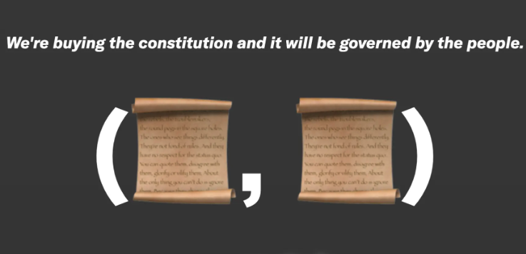
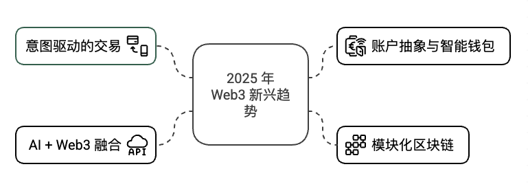

> 区块链技术现在已经从单一的加密货币支付系统发展为涵盖金融、艺术、组织治理和社区文化的多元生态系统。这次我们将深入解析 DeFi（去中心化金融）、NFT（非同质化代币）、DAO（去中心化自治组织）与 MEME（模因币）四大领域，通过典型案例剖析其核心机制，为大家提供全面的入门指南，以便更好地寻找实习相关岗位。

## 一、DeFi：去中心化金融的创新实践

DeFi，全称为 Decentralized Finance（去中心化金融），是基于区块链技术建立的金融体系，目标是提供不依赖传统银行或金融中介的服务，比如借贷、交易、支付等，让每个人都可以自由参与，无需审批、无需信任中介机构。以下是 DeFi 领域的三个典型案例：

### 1. Uniswap：去中心化交易所（DEX）

Uniswap 是去中心化交易所（DEX）的代表，由 Hayden Adams 于 2018 年创立。其核心创新在于引入“自动做市商”（AMM）模式，通过“恒定乘积公式”[+恒定乘积公式] 实现代币定价。用户通过存入流动性池（如 ETH 和 DAI）成为流动性提供者（LP），赚取交易手续费。
[+恒定乘积公式]: x \* y = k

::: steps

1.  ==**恒定乘积公式：x \* y = k**==

    这个公式听起来复杂，但它的核心思想其实很简单。我们可以把它想象成 Uniswap 是一个非常聪明的自动交易员，它通过一个简单的数学公式来决定价格，而不依赖人工设置或市场波动。

    - **x** 和 **y** 代表流动性池中的两种加密货币，比如 ::token-branded:eth =24::ETH 和 ::token-branded:usdc =24::USDC。
    - 比如一个流动性池里，假设有 10 个 ETH 和 5000 个 USDC。那么：
      ::: center
      x = 10（ETH）
      y = 5000（USDC）
      :::
      公式如何工作？

    - 恒定乘积公式就是 **x \* y = k**，其中 **k** 是一个常数。
      ::: center
      10 \* 5000 = 50,000（这就是 k 的值）
      :::
      当你在这个池子里进行交易时，这个公式始终要保持成立。也就是说，交易后，ETH 和 USDC 的数量会发生变化，但它们相乘的结果 **k** 必须始终是 50,000。

    ::: note 举个例子：

    - 如果你想用 1 个 ETH 兑换 USDC，流动性池中的 ETH 数量就会减少，而 USDC 的数量就会增加。
    - 假设交易后，池中的 ETH 变成了 9 个，那么为了保持公式成立，USDC 数量需要调整到 5555.56 个（9 \* 5555.56 = 50,000）。
    - **具体兑换价格计算**：
      - 交易前：10 ETH，5000 USDC
      - 交易后：9 ETH，5555.56 USDC
      - 你用 1 ETH 兑换到了 5555.56 - 5000 = 555.56 USDC
      - **兑换价格 = 555.56 USDC / 1 ETH = 555.56 USDC per ETH**
    - 这样，Uniswap 就能自动算出兑换的价格，而且随着池子中资产比例的变化，价格也会自动调整。
      :::
      Uniswap 通过这个公式，自动决定每个交易的价格和兑换率。它确保了池子的总价值始终保持平衡，避免了价格波动过大。

2.  ==**流动性池和流动性提供者（LP）**==

    流动性池是 Uniswap 交易的核心。它是由很多用户共同提供的资金池，用于交易中的兑换。你不再需要通过一个中心化的交易所来等待配对和匹配订单。你只需要加入流动性池，Uniswap 就会根据池子里的资金自动帮助你完成交易。

    **那流动性提供者（LP）是如何赚钱的？**

    - 当你把资金存入流动性池时，你成为了流动性提供者（LP）。每当别人进行交易时，你提供的资金就会被用来进行兑换。
    - LP 在每次交易中都会收取一定的 **交易手续费**（通常是 0.3%）。这些手续费会根据你在流动性池中提供的资金比例进行分配。

    ::: note 举个例子：

    - 假设你存入了 1 ETH 和 5000 USDC 到一个 ETH/USDC 的流动性池。如果别人用 1 ETH 交换了 5000 USDC，那么这个交易会产生 15 USDC 的手续费（0.3%）。
    - **具体收益计算**：
      - 交易手续费：5000 USDC × 0.3% = 15 USDC
      - 如果你提供了池子总资金的 10%，你获得的手续费收入：15 USDC × 10% = 1.5 USDC
    - 当然，实际情况会因为池子大小、交易量、市场波动等因素而不同，这里只是一个简化的例子。
      :::

3.  ==**去中心化 vs. 中心化交易所的好处**==

    去中心化交易所（DEX）相比于传统的中心化交易所（如币安、火币等），有很多优势。最重要的几点包括：

    | 特点                         | 去中心化                                                                                                                     | 中心化                                                                                             |
    | ---------------------------- | ---------------------------------------------------------------------------------------------------------------------------- | -------------------------------------------------------------------------------------------------- |
    | **交易不需要中介，快速方便** | 你直接用自己的钱包进行交易，不需要像中心化交易所那样注册账户、上传身份证等繁琐步骤。                                         | 需要通过一个平台来进行配对和交易，往往存在人工审核、系统延迟等问题，交易可能比较慢。               |
    | **24/7 全天候交易**          | 无论你身在何处，任何时候都能进行交易。没有交易时间的限制。                                                                   | 通常会受到全球市场交易时间、服务器维护等因素的影响。尤其是某些交易所还可能进行系统升级或停机。     |
    | **大额交易更便捷**           | 你不需要等待层层审批，特别是对于一些大额资金的交易，完全依赖智能合约和流动性池来完成。所有交易都直接在链上进行，快速而高效。 | 大额资金的交易通常需要通过银行、金融机构等审批环节，可能还要经过反洗钱审查等复杂的程序，时间较长。 |

:::

### 2. Compound：去中心化借贷协议

Compound 是一个去中心化的借贷平台，允许用户借入或借出加密资产。由 Robert Leshner 于 2017 年创建，Compound 利用智能合约和去中心化金融 (DeFi) 的理念，彻底改变了传统借贷模式。用户在平台上存入资产并获得相应的 **cToken**，这是一种代表用户在协议中存入资金的代币。用户可以通过这个代币赚取利息，同时也可以借入其他资产，但需要提供超额担保。

::: steps

1. ==**流动性挖矿与利息收入**==

   - 用户将自己的资产（如 ETH、DAI）存入 Compound，便能获得 cToken。比如，如果你存入 1 个 ETH，系统会给予你相应的 cETH 代币。
   - 利息是根据实时市场动态决定的，平台采用动态利率模型。当借贷需求增加时，利率会上升，反之则会下降。

2. ==**借贷模式与超额抵押**==

   - 用户在借入资产时，必须提供超额的担保。例如，如果小明想借出 2000 美元的 USDC，那么他需要抵押超过等值的资产（如 ETH）。
   - 如果市场波动导致抵押资产的价值低于借款要求（例如小明抵押的 ETH 被市场价格大幅波动），Compound 会触发 ==**强制清算**=={.danger}，即强制卖出部分抵押资产来偿还贷款。

::: note **举个例子**

小明手上有 5 个 ETH，但他需要 2000 美元现金。他可以把这 5 个 ETH 抵押到 Compound，系统会根据市场情况发放相应的 USDC（比如 2000 美元等值的 USDC）。通过这种方式，小明可以获得所需的资金，而不必卖掉自己的 ETH。

**重要：关于价格变化的影响**

- 小明需要偿还的 USDC 数量是固定的（2000 USDC + 利息），不会因为 ETH 价格上涨而改变
- 如果 ETH 价格上涨，小明其实赚了：他用价值更高的 ETH 作为抵押，但偿还的 USDC 数量不变
- 如果 ETH 价格下跌过多，可能会触发强制清算，系统会自动卖出部分 ETH 来偿还贷款

**具体例子**：

- 抵押时：ETH 价格 $2000，抵押 5 ETH（价值 $10,000），借出 2000 USDC
- 价格上涨后：ETH 价格 $3000，抵押物价值 $15,000，但仍只需偿还 2000 USDC + 利息
- 这样小明既获得了流动性，又享受了 ETH 价格上涨的收益

通过这种机制，Compound 不仅为借款人提供流动性，也为存款人提供利息回报。整个过程都由智能合约自动执行，极大地提高了效率和透明度。
:::

### 3. MakerDAO（现已更名为 Sky）：稳定币系统

MakerDAO 是一个去中心化的借贷协议，它允许用户通过超额抵押资产来生成 **DAI**，一种与美元挂钩的稳定币。DAI 的价值稳定在 1 美元左右，因此可以作为一个避险工具或支付手段。MakerDAO 通过智能合约管理抵押资产，并利用 **稳定费率** 来调整系统中 DAI 的供需关系。

::: info 品牌更新
**2024 年品牌升级**：MakerDAO 已正式更名为 **Sky**，并推出了新的代币体系。DAI 稳定币升级为 **USDS**（Sky Dollar），MKR 治理代币升级为 **SKY**。虽然品牌焕新，但其核心的超额抵押稳定币机制保持不变。用户可以选择继续使用 DAI，也可以升级到 USDS 享受更多功能。
:::
::: steps

1. ==**超额抵押生成 DAI**==

   在 MakerDAO 中，用户可以将其资产（如 ETH、BAT 或其他加密货币）抵押到系统中，并通过智能合约生成与美元挂钩的 DAI 稳定币。生成 DAI 时，用户的资产需要超额抵押，例如用户必须将价值 2 美元的资产抵押，才能生成 1 美元的 DAI。

2. ==**稳定费率与清算机制**==

   - 为了确保 DAI 稳定，MakerDAO 使用 **稳定费率** 来调节市场。稳定费是用户在还款时需要支付的利息。这一机制帮助 MakerDAO 控制 DAI 的供应量，避免其脱离 1 美元的目标价格。
   - 如果抵押资产的价值下降，且用户的抵押率低于系统设定的安全阈值，系统会触发 **清算**，自动将抵押资产出售以偿还债务，防止系统破产。

::: note **举个例子**

假设小明持有很多 ETH，但他担心市场波动，想换成一个更加稳定的资产。他可以将 1 个 ETH（价值约 3500 美元）抵押到 MakerDAO，并生成 2000 个 DAI（1 DAI ≈ 1 美元）。这 2000 个 DAI 可以用于消费、投资或存款。当小明希望取回 ETH 时，他只需要偿还 2000 个 DAI 和相关的稳定费，系统将退还给他 1 个 ETH。

Sky（原 MakerDAO）的这种超额抵押和去中心化的稳定币生成机制，不仅为用户提供了资金的灵活性，还为加密市场提供了一个相对稳定的货币单位。
:::

## 二、NFT：数字所有权的革命

### 1. **NFT 的本质：数字资产的唯一性和所有权**

传统的数字文件（如图片、视频、音频）可以被无限复制，这就导致了“所有权”变得模糊。比如，你在网上下载了一张图片，虽然你拥有它的副本，但原始的“所有权”属于创作者或某个授权的主体。

而 NFT 通过区块链技术解决了这一问题。每个 NFT 代表一个唯一的数字资产，并且在区块链上存有不可篡改的记录。**区块链技术**的核心特点是，它是一种去中心化、公开透明的账本，所有交易和所有权信息都被记录在上面。因此，通过 NFT，你不仅可以拥有数字文件的“副本”，而且可以拥有它的**唯一性和所有权**，这一点无法被复制或篡改。

### 2. **智能合约：自动化的所有权转移和交易**

NFT 背后的另一项重要技术是**智能合约**。智能合约是一种自执行的协议，意味着合约中的条款在满足特定条件时会自动执行，而无需第三方中介。这些合约不仅能确保交易的安全性和自动化，还能赋予 NFT 一些特别的功能。

例如，在 NFT 交易中，智能合约可以设定当你转售该 NFT 时，原作者会自动获得一定比例的转售收入（这被称为“版税”）。这个过程是自动化的，根本不需要依赖传统的艺术经纪人或拍卖行。

下面介绍两个实际的 NFT 案例：

### 3. **CryptoPunks：NFT 的先锋**

CryptoPunks 可以被看作是 NFT 历史中的“先驱者”。由 Larva Labs 于 2017 年创建，CryptoPunks 是一系列由 10,000 个像素风格的头像组成，每个头像都有其独特的属性（如不同的发型、眼睛、面部特征等）。这些头像一开始并未得到广泛重视，但随着 NFT 和加密货币市场的崛起，CryptoPunks 成为了最早的 NFT 收藏品之一，并且逐渐形成了专属的社群和文化。

通过区块链，这些 CryptoPunks 的所有权和历史交易都得到了记录，任何人都可以验证某个 Punk 是否属于你，也能看到它的历史交易价格、所有者等信息。

### 4. **OpenSea：NFT 交易的中心**

OpenSea 是目前全球最大的 NFT 交易平台，基本上覆盖了所有主流 NFT 的交易。它与传统的艺术品拍卖平台（如 Sotheby’s）不同，OpenSea 通过区块链技术让任何人都能轻松买卖 NFT。用户不仅可以在 OpenSea 上买卖 CryptoPunks、Bored Ape Yacht Club（另一大知名 NFT 项目）等，还能创建自己的 NFT 并发布在平台上。

OpenSea 的创新在于，它不仅仅是一个交易平台，它的基础设施使得 NFT 能够快速流通，所有权记录通过区块链系统得到确认和传递。你不再需要通过传统的金融系统，而是可以直接用加密货币（如以太坊）进行交易。

## 三、DAO：去中心化自治组织的崛起
::: card
想象一下，如果你和一群志同道合的朋友，不用任何老板，也不需要复杂的公司结构，通过投票、分享资源，共同决定一个组织的未来——这就是 DAO 的核心理念。

DAO（Decentralized Autonomous Organization，去中心化自治组织），不依赖传统的公司架构，而是通过智能合约和社区投票来做决策。它不需要一个管理层，所有事情都由持有代币的社区成员共同治理，公开透明，没有什么事情可以背着大家，尤其是利益分配相关的问题。
::: 

### 1. Nouns DAO：社区驱动的 NFT 艺术 DAO

Nouns DAO 就像是艺术和区块链的结合体，每天都会生成一个独一无二的 NFT —— 一个卡通小人头像。这些头像会通过拍卖出售，所有的收益都会存入 DAO 的金库。

持有 Nouns NFT 的人不仅仅是收藏者，还能参与组织的决策。比方说，你可以投票决定 DAO 要用这些资金做什么：是不是资助一个有创意的开源项目？还是做一个线下活动？这些决定都由大家一起讨论和投票决定，完全靠社区力量。

有点像你和朋友们搞一个共同的艺术收藏项目，每个人都有发言权，大家一起决定项目的走向，而每个人通过持有 NFT 的方式，都能分享到这个过程的乐趣。

### 2. LXDAO：支持 Web3 公共物品的建设者

LXDAO 是一个特别专注于 Web3 公共物品的项目。Web3 是一种更自由、更去中心化的互联网形态。LXDAO 通过支持开源项目、资助创新项目，推动这一理念的实际落地。

它的运作方式有点像是一个“工会”加“奖励平台”。大家根据兴趣和专长，承担不同的任务。完成任务后，你会获得相应的奖励。每个社区成员都可以自发的组织或者发起一些倡议，获得大家的讨论和反馈，如果确认对社区有帮助，则会得到社区的支持一起做出来。

可以把它想象成一个远程工作的组织，每个人都能通过贡献自己的时间和技能，帮助建设一个去中心化的未来。最棒的是，这个组织不仅仅是“做事”，而且有公平的机制奖励贡献者。这些也都是基于区块链和智能合约实现的。

### 3. ConstitutionDAO：一场疯狂的拍卖

在 2021 年，**ConstitutionDAO** 成为了全球关注的焦点。这群人大胆设想——如果大家齐心协力，是不是能合力购买一份《美国宪法》的原稿？听起来像是个疯狂的想法，但他们真这么做了。

ConstitutionDAO 通过几万人共同参与，成功筹集了 **4700 万美元**，准备在拍卖中竞争。这份《美国宪法》原件被拍卖出来，成为了一个具有历史意义的物品，而他们的目标就是让普通人有机会共同参与购买，而不是由传统的博物馆或私人收藏家垄断。

不过，最终他们没有成功竞标到宪法副本，这个事件仍然展现了 DAO 的巨大潜力——不仅仅是小项目，DAO 的形式也能让大众共同参与到那些传统上只能由少数人决定的重大事项中。在瞬间从全地球人手中募集 4700 万美元来实现某个目标也体现了 DAO 来解决问题的巨大潜力。

然而，这场拍卖也暴露了 DAO 的一个**缺点**：过于公开透明的结构让其他竞标者能够轻易了解你的出价情况。例如，其他拍卖方可能提前知道了 ConstitutionDAO 的筹集金额，他们可以轻松在拍卖结束前稍微提高出价，就能拿下宪法副本。这种信息不对称，让 DAO 在竞争中处于了劣势，最终没有如愿以偿。

这也让我们看到，DAO 虽然有无限潜力，但在操作上还是需要克服一些问题，比如如何保护参与者的隐私和资金安全，避免过多的外部干扰。尽管如此，ConstitutionDAO 的尝试依然为 DAO 模式开辟了新天地，也为未来的去中心化集体行动提供了宝贵的经验。

这场拍卖不仅仅是为了获得一个历史文物，它也让人们开始重新思考，DAO 不再只是“虚拟货币”或“小众项目”的代名词，甚至有可能成为打破传统精英控制、让大众参与重大历史事件的全新方式。

## 四、MEME：文化与投资热潮

MEME 原意为“迷因”，即网络文化中的梗、表情包、搞笑段子等。在加密圈，MEME 通常指那些以网络文化为基础的代币，比如 DOGE（狗狗币）、PEPE（青蛙币）、SHIB（柴犬币）等。

MEME 币的特点通常是“有趣、搞怪、社区驱动”，它们往往缺乏明确的技术价值，但通过强大的社区共识和文化认同获得价值。2024-2025 年，MEME 币市场出现了新的特点：**公平发射**（Fair Launch）、**社区自治**和**实用性整合**成为新趋势。

::: warning 投资风险提醒
MEME 币具有极高的投机性和波动性。价格可能在短时间内暴涨暴跌，投资者应谨慎评估风险，仅投入能够承受损失的资金。在本书中仅作展示和介绍，不鼓励和引导投机行为。
:::

```mermaid
pie
    title MEME币爆发要素
    "社区叙事" : 40
    "代币分配" : 25
    "KOL传播" : 20
    "技术噱头" : 15
```

### 1. ::token-branded:doge =30::DOGE：MEME 币的开山鼻祖

DOGE 借用了“狗狗”表情包形象。2021 年，特斯拉 CEO 埃隆·马斯克（Elon Musk）通过推特频繁提及 DOGE，甚至宣布特斯拉接受 DOGE 支付，推动 DOGE 市值突破 800 亿美元。

但后来马斯克的态度发生变化，特斯拉暂停接受 DOGE 支付，并且他在节目中表示对加密货币的复杂态度，导致 DOGE 价格大幅波动。这种依赖名人效应的模式让投资者在市场情绪波动中成为“接盘侠”。

DOGE 代币高度集中，少数大户掌控价格，散户投资者面临着极大的被操控风险。

### 2. ::token-branded:pepe =30::PEPE：社区驱动的 MEME 币

PEPE 基于“悲伤青蛙”形象，发行总量高达 420.69 万亿枚。2024 年市值突破 58 亿美元，成为 MEME 币“战神”。

### 3. 新手如何规避 MEME 币风险？

::: steps

1.  **警惕“无实际价值”的炒作**

    - MEME 币通常缺乏技术支持或应用场景（如 DOGE 的“支付功能”从未普及），其价格完全依赖市场情绪，极易遭遇暴跌风险。
    - **教训**：例如在 2024 年，《黑神话：悟空》游戏爆火时，多个“悟空”概念的 MEME 币上线，但迅速崩盘，无人问津，投资者最终损失惨重。
       
       

2.  **拒绝盲目跟风**

    - 名人效应（如马斯克）、政治事件（如特朗普）可能短期内推动价格飙升，但这种效应不具备持续性。
    - **教训**：TRUMP 币在 2025 年初因为政治事件引发市场暴涨后，最终跌回原点，散户遭遇重大损失，XBIT 平台通过熔断机制保护了部分用户资产。
       
       

3.  **关注链上数据透明度**

    - 项目方是否公开代币分配、核心地址信息？如果代币高度集中，可能会被少数大户操控价格，导致投资者亏损。
    - **教训**：SEC 对匿名交易的监管直接导致多个 MEME 币项目的停摆，说明缺乏透明度的项目潜藏巨大的风险。
       
       

4.  **分散投资，控制仓位**

    - 即使你选择参与 MEME 币投资，也要严格控制风险，将资金控制在总持仓的 10% 以内，避免单一投资带来过大风险。
    - **数据参考**：2025 年 6 月，MEME 币市场的总市值突破 624 亿美元，但其中 75% 的项目都是在过去一年内创建的，泡沫风险极高。

:::

## 五、交叉创新领域

随着 Web3 技术的发展，各个细分领域开始相互融合，产生了许多创新应用。这些跨领域的组合不仅拓展了单一技术的应用边界，还创造了全新的商业模式和用户体验。

### 1. ==DeFi + NFT：数字资产金融化=={.important}

**NFT 抵押借贷**是这个领域最典型的应用。传统上，NFT 作为非同质化代币流动性较差，持有者很难在不出售的情况下获得流动性。DeFi + NFT 的结合解决了这个问题。

::: steps

1. **BendDAO 的 P2Pool 模型**

   - **核心机制**：用户可以将蓝筹 NFT（如 BAYC、CryptoPunks）作为抵押品，从流动性池中借出 ETH
   - **价格发现**：通过 Floor Price 预言机实时获取 NFT 地板价，确定可借贷金额
   - **风险控制**：设置清算阈值，当 NFT 价值下跌到危险水平时自动拍卖
   - **实际应用**：如果你持有一个价值 100 ETH 的 BAYC，可以抵押获得约 40 ETH 的流动性，同时保持 NFT 所有权

2. **碎片化流动性解决方案**

   - **Sudoswap 的 AMM 改进**：将 Uniswap 的 AMM 模型应用到 NFT 交易，创建 NFT 流动性池
   - **价格曲线**：通过 Bonding Curve 算法自动调整不同稀有度 NFT 的价格
   - **用户体验**：买家可以像在 Uniswap 兑换代币一样购买 NFT，无需等待卖家匹配

:::

### 2. ==DAO + MEME：社区文化与治理融合=={.important}

**MEME 币与 DAO 治理**的结合创造了一种全新的社区组织形式，既保持了 MEME 文化的趣味性，又具备了实际的治理功能。

::: steps

1. **社区代币分发创新**

   - **FriendTech 的 Key 机制**：
     - 用户通过购买 KOL 的“Key”获得私聊权限和收益分成
     - Key 价格随供需变化，形成社交影响力的金融化
     - 持有者可以参与该 KOL 的社区决策，如内容方向、合作项目等
   - **具体运作**：比如某个 Crypto KOL 发行了 1000 个 Key，早期支持者以 0.1 ETH 购买，随着影响力增长，Key 价格上涨到 1 ETH，持有者既获得了经济收益，也获得了社区话语权

2. **MEME 币社区治理模式**

   - **Shiba Inu 的 ShibaSwap**：不仅是交易协议，还是社区治理平台
     - SHIB 持有者可以投票决定协议升级、新功能开发、合作伙伴选择
     - 通过“Doggy DAO”机制，社区成员提交提案，全民投票决定发展方向

3. **创新应用场景**

   - **Nouns DAO**：每天拍卖一个新的 Noun NFT，收益进入 DAO 金库
     - 持有者可以提案使用资金，如资助创意项目、举办活动、开发工具
     - 将 MEME 文化（有趣的像素头像）与严肃的治理相结合

:::

### 3. ==AI + DeFi：智能化金融服务=={.important}

**人工智能与去中心化金融**的结合正在创造更智能、更高效的金融服务体验。

::: steps

1. **智能投资策略**

   - **Yearn Finance V3**：集成 AI 算法优化收益策略
     - 分析链上数据，预测最优收益农场时机
     - 自动调整资产配置，最大化用户收益
   - **dHEDGE Protocol**：AI 管理的去中心化基金
     - 基金经理使用 AI 模型制定投资策略
     - 投资者可以跟投表现优秀的 AI 策略

2. **风险管理与预测**

   - **Gauntlet**：为 DeFi 协议提供 AI 风险管理服务
     - 实时监控协议风险参数，如抵押率、清算阈值
     - 通过机器学习预测市场波动，提前调整参数
   - **Chaos Labs**：AI 驱动的协议安全审计
     - 模拟各种极端市场情况，测试协议韧性
     - 为协议提供动态风险评估报告

3. **用户体验优化**

   - **1inch 的 AI 路由**：智能寻找最优交易路径
     - 分析数百个 DEX 和流动性池
     - 考虑 Gas 费用、滑点、MEV 等因素
     - 为用户提供最优交易方案
   - **Zapper.fi**：AI 驱动的 DeFi 组合管理
     - 自动识别用户的 DeFi 仓位和收益情况
     - 提供个性化的策略建议

:::

::: card
这些跨领域的创新不仅展示了 Web3 技术的可组合性，也为用户创造了更丰富的应用场景。随着技术的不断发展，我们预计会看到更多领域的融合创新，如 Social + DeFi、IoT + Blockchain 等。
:::

### 4. ==WEB3 + 乡建：南塘 DAO 的探索=={.important}

> 2024 年 8 月，在 **SeeDAO** 的持续推动与 **LXDAO** 的孵化支持下，一群年轻人相聚在安徽省阜阳市南塘兴农合作社，成立了中国首个致力于将 Web3 落地于乡村的组织——==南塘 DAO== 。  
> 南塘 DAO 秉持“向乡土求共同体之 DAO，向加密寻世界性之道”的核心理念，旨在促进乡建与 Web3 领域的深度交流与融合，推动双方互学互鉴。  

::: steps

1. **南塘豆：**

    南塘 DAO 在 OP 链上发行了 ERC20 标准的 Token ——南塘豆（代号：NT）。该代币主要用于量化成员贡献并作为 DAO 治理投票的凭证。鉴于南塘合作社文化大院是南塘 DAO 乡村活动的主要基地，南塘 DAO 每月将增发相当于当月总支出的 20% 的南塘豆分配给南塘合作社（该部分南塘豆具备投票权）。
    
    在中国现行法律框架下，南塘豆被界定为虚拟商品，可在当地特定场景中用于交换商品与服务。**应用实例包括：** 使用南塘豆购买咖啡、果汁、午餐、社区超市商品（支付比例为 50% 人民币 + 50% 南塘豆），或用于南塘合作社住宿消费等。其应用场景仍在持续拓展中。为便利村民适应这一新型社区货币，南塘 DAO 为老年人提供了社区货币卡片，并帮助年轻村民使用社区数字身份（详见[南塘 DAO 相关网站：社区数字身份](app.ntdao.xyz)）。
    
    

2. **乡村共居：**

    ==**南塘合作社文化大院：**==

    我们之所以在南塘相聚，根源在于南塘兴农合作社深厚的社区自治土壤。合作社的历史可追溯至 1998 年，最初由本土农民为维护自身权益自发组织成立，成功推动了不合理政策的改变。此后，在 **温铁军、刘老石** 等学者与实践者的引领下，合作社积极融入“新乡建运动”，实现了从维权到乡村建设的转型，其探索延续至今。

    南塘合作社的发展历程蕴含着强烈的自组织精神，这种由基层社群自发凝聚力量、追求公正与发展的内核，与区块链技术诞生的初衷高度契合。

    进入新时代，南塘合作社持续深化自治实践，创新性地将罗伯特议事规则本土化为“萝卜白菜规则”，有效应用于村民自治与集体决策。同时，通过组织丰富的文娱活动，显著提升了村民的精神文化生活品质，其治理模式展现出前瞻性。村民们还自力更生，亲手建造了如今的合作社文化大院，在这里树立起了合作的丰碑。

    南塘 DAO 正是从南塘合作社这份宝贵的自治传统中汲取经验，运用区块链技术，通过 DAO 这一高度契合其自治基因的组织形式，探索 Web3 与乡村建设的深度交融。==在实践过程中，团队在农业生产、卫生维护、膳食自理及社区融入等基础性环节面临现实挑战，这正是一个原生线上社区向线上线下协同治理模式演进时所遇到的典型课题。=={.info} 目前，社区成员正以务实的态度积极适应环境，并持续推动改进。

    ==**成都箭塔村院落：**==

    成都箭塔村院落受成都箭塔在地的吾乡乡村创业孵化器启发。该项目以协商民主方式，结合非遗文化激发乡村内生动力。箭塔村院落旨在建立一个以 DAO 形式组织的乡创创新创业者基地，当前聚焦于非遗文化的商品化开发与社群生活内容创作。通过跨地域协作，群策群力，团队正着力构建更完善的基础设施，为乡村创新创业者提供社区支持。

3. **PGS + 区块链：**

    在与生态农人的沟通中，团队意识到生态农产品在市场上难以广泛流通的原因在于真正做生态农业的小规模农场很难获得中心化机构的认证。食品安全问题的解决，非单纯依靠技术或中心化机构，关键在于重构生产关系——这正是区块链技术的核心价值所在。
    
    因此，南塘 DAO 提出了将 ==PGS（公众参与的社会化保障体系）=={.info} 与区块链技术结合的方案。利用区块链的不可篡改性，将农产品认证权力从中心化机构转移到由一个个真实个体所组成的社区。社区推动公平田野（一个由生态农场组成的联盟）在其社区体系中采用区块链技术。目前处于系统开发与运营模式探索阶段，正尝试针对考察和实践反馈完善具体功能。

4. **启蒙计划：**

    我们组织了 Web3 用于乡村振兴案例的线上分享、面向高校乡建伙伴的宣讲团、合作开发了面向新手的 Web3book 等活动，极大扩张了乡建领域对于Web3如何帮助乡村振兴的认知。

    目前已开展包括 Web3 助力乡村振兴案例线上分享、面向高校乡建伙伴的宣讲团，并合作开发面向新手的 Web3book 教材等活动，显著拓宽了乡建领域对 Web3 如何助力乡村振兴的认知。

5. **乡创计划：**

    乡创计划旨在构建跨地域去中心化协作的基础设施，以解决乡村资源分散制约规模效应有效发挥的难题。项目初期以非遗文化的商品化开发为切入点，通过举办非遗艺术共创营活动，培育乡村创新创业者社群。计划引导青年群体深度接触、体验非遗文化，发掘个人与非遗的结合点，并将其转化为可持续运营的项目。通过为社群内的青年创造者提供系统性支持，充分释放其创造力，进而带动乡村发展。
:::

## 六、2025 年新兴趋势

### 1. ==**Intent-Based 交易**==

传统的 Web3 交易需要用户明确指定每一步操作（如选择 DEX、设置滑点等），而意图驱动的交易允许用户表达目标（如“用 100 USDC 买到最多的 ETH”），由系统内不同的求解器给出报价，系统最终自动寻找最优报价对应的路径执行。

**核心技术栈：**

- **Solver 网络**：专门的求解器竞争为用户找到最优解决方案
- **Intent 标准化**：ERC-7683 等标准定义意图表达格式
- **跨链聚合**：自动在多个链之间寻找最佳流动性

**代表项目：**

- **UniswapX**：基于荷兰拍卖的意图交易协议
- **1inch Fusion**：零 Gas 费的意图驱动 DEX 聚合器
- **CoW Protocol**：专注 MEV 保护的批量交易协议

### 2. ==**账户抽象与智能钱包**==

账户抽象（Account Abstraction, AA）通过 ERC-4337 标准，让以太坊账户具备智能合约的灵活性，用户无需持有 ETH 即可进行交易，支持社交恢复、批量操作等高级功能。

**核心功能：**

- **Gas 代付**：第三方可为用户支付交易费用
- **社交恢复**：通过朋友/家人恢复钱包，而非助记词
- **批量交易**：一次签名执行多个操作
- **自定义验证**：支持生物识别、多重签名等

**代表项目：**

- **Safe**：企业级多重签名智能钱包
- **Argent**：移动端智能钱包先驱
- **ZeroDev**：开发者友好的 AA 基础设施

### 3. ==**模块化区块链**==

2025 年的区块链架构向模块化发展，将执行、共识、数据可用性、结算等功能分离，实现更好的可扩展性和可定制性。

**核心层级：**

- **结算层**：最终性和争议解决（Ethereum L1）
- **数据可用性层**：数据存储和检索（Celestia、EigenDA、Ethereum Blob）
- **执行层**：交易处理和状态转换（Optimism、Arbitrum）
- **共识层**：区块排序和最终确定（Ethereum PoS）

**代表项目：**

- **Celestia**：专用数据可用性层
- **Polygon CDK**：可定制的 zkEVM 部署工具
- **OP Stack**：模块化的 Optimistic Rollup 框架

### 4. ==**AI + Web3 融合**==

人工智能与 Web3 的结合创造了新的应用范式，从去中心化 AI 训练到 AI 驱动的自动化交易。

**主要方向：**

- **去中心化 AI 训练**：分布式计算资源共享
- **AI 代理**：自主执行的智能合约机器人
- **预测市场**：AI 增强的市场预测和决策
- **内容生成**：AI 创作的 NFT 和数字资产

**代表项目：**

- **Fetch.ai**：AI 代理网络
- **SingularityNET**：去中心化 AI 市场
- **Render Network**：分布式 GPU 计算网络

## 七、学习建议与职业规划

### 对于初学者：

1. **基础优先**：深入理解 DeFi 核心概念，而非追逐最新热点
2. **实践学习**：在测试网上体验各种协议，理解用户流程
3. **安全意识**：了解常见攻击向量和防护措施

### 对于求职者：

1. **专业化发展**：选择 1-2 个领域深入研究
2. **技术栈匹配**：根据目标岗位学习相应技术
3. **项目经验**：参与开源项目或 Hackathon
4. **行业动态**：持续关注最新发展和监管变化

### 延伸阅读资源：

- **技术文档**：Ethereum.org、各项目官方文档
- **研究报告**：Messari、The Block、Delphi Digital
- **播客节目**：Bankless、ETHPanda Talk

::: tip 持续学习提醒
Web3 行业发展极快，本手册内容会定期更新。建议关注项目官方渠道获取最新信息，避免基于过时信息做出决策。
:::

## ::eos-icons:application-outlined /#32b2f0::扩展阅读

**官方文档：**

- [Ethereum.org](https://ethereum.org/) - 以太坊官方文档
- [Uniswap Docs](https://docs.uniswap.org/) - Uniswap 协议文档
- [OpenSea Learn](https://opensea.io/learn) - NFT 入门指南

**研究报告：**

- [Messari](https://messari.io/research) - 区块链项目深度分析
- [The Block](https://www.theblock.co/research) - 行业数据和趋势
- [Delphi Digital](https://delphidigital.io/research) - 加密市场研究

**中文资源：**

- [ETHPanda](https://ethpanda.org/) - 以太坊中文社区
- [LXDAO](https://lxdao.io/)

**南塘DAO相关网站**
- 论坛：[forum.ntdao.xyz](forum.ntdao.xyz)
- 工时记录：[app.fairsharing.xyz/project/0x8e5B25E1b0093c3882Bd405998462a1365f21930/contribution](https://app.fairsharing.xyz/project/0x8e5B25E1b0093c3882Bd405998462a1365f21930/contribution)
- 投票治理：[snapshot.box/#/s:ntdao.eth](https://snapshot.box/#/s:ntdao.eth)
- 社区数字身份：[app.ntdao.xyz](app.ntdao.xyz)
- 第一本 Web3 图书：[figma.com/design/e3pGC4j9qiQ8cAdHyCAxds/Untitled?node-id=0-1&p=f&t=gc8ob1kjJ5zIZwTn-0](https://www.figma.com/design/e3pGC4j9qiQ8cAdHyCAxds/Untitled?node-id=0-1&p=f&t=gc8ob1kjJ5zIZwTn-0)

## ::ep:avatar /#32b2f0::文章贡献者

作者：[吃汤圆](https://x.com/web3_cty)、 [古忆]()  
排版：[Echo](https://x.com/Echo_liuchan)  
校对：[Bruce](https://x.com/brucexu_eth)
